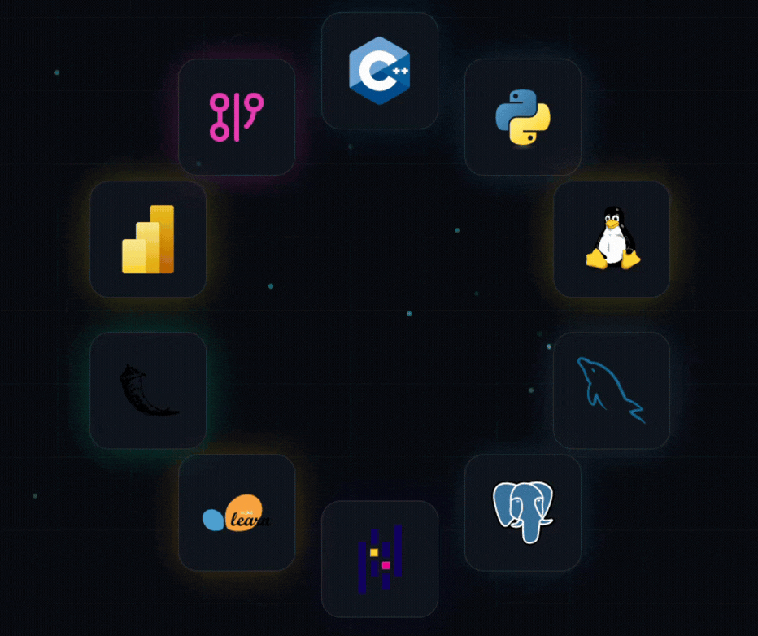

<table width="100%">
<tr>
<td width="50%" valign="middle">

<h1>Hey, I'm Ayan</h1>
<h3>Software Engineer from India</h3>

Passionate about Backend Development, Machine Learning, and building scalable software systems.

</td>

<td width="50%">

</td>
</tr>
</table>

<h2 align="left">Technologies I use:</h2>

<table width="100%">
<tr>

<td width="50%" valign="top">

<ul>
<li>C++</li>
<li>Python</li>
<li>Linux</li>
<li>MySQL</li>
<li>PostgreSQL</li>
<li>Pandas</li>
<li>Scikit-Learn</li>
<li>Flask</li>
<li>Power BI</li>
<li>Data Structures & Algorithms</li>
<li>Machine Learning</li>
<li>Backend Development</li>
</ul>

</td>

<td width="50%" valign="middle">

</td>

</tr>
</table>

<h2 align="left">Connect with me:</h2>

